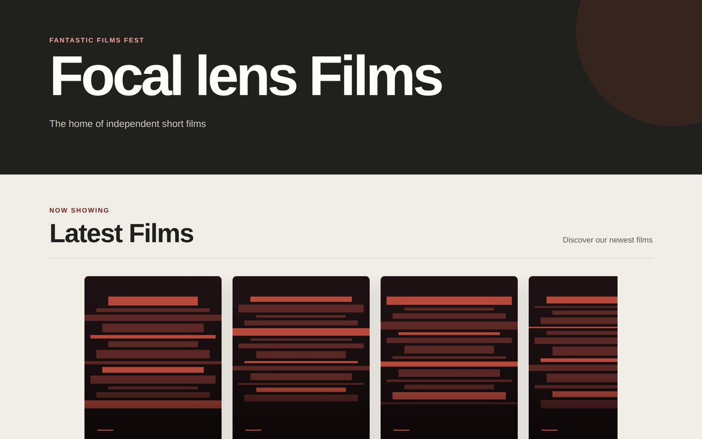
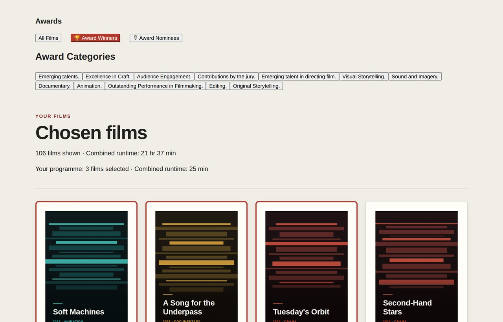
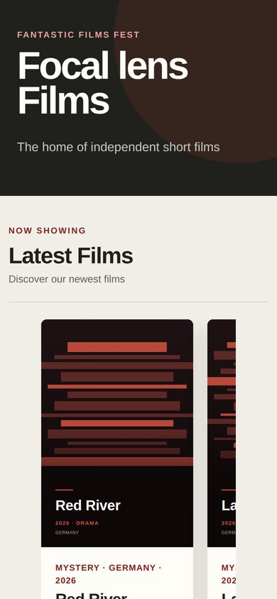
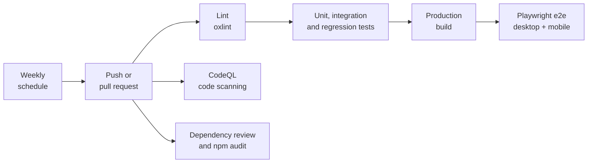
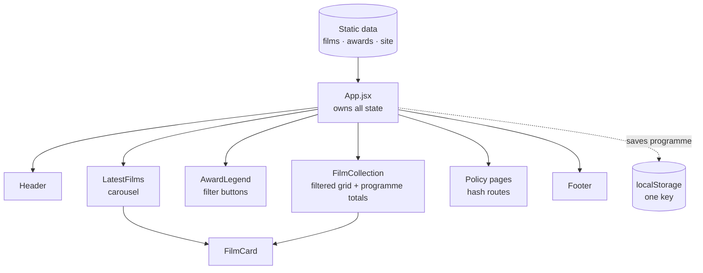

<div align="center">

# 🎬 Focal lens Films

**A short-film showcase where you browse award-winning shorts and build your own screening programme.**

Built with React 19 and Vite, tested at three levels with Vitest and Playwright, and shipped through a CI pipeline with security scanning on every change.

[](https://github.com/CyberSinclair/Directors-notes/actions/workflows/ci.yml)
[](https://react.dev/)
[](https://vite.dev/)
[](https://vitest.dev/)
[](https://playwright.dev/)
[](https://codeql.github.com/)

[Features](#-features) · [Testing](#-testing) · [CI and security](#-ci-and-security) · [Architecture](#-architecture) · [Run it locally](#-run-it-locally)

</div>

---



## 💡 About

Focal lens Films is a single-page site for discovering independent short films. Visitors can scroll the latest releases, filter a catalogue of 180 shorts by award status and category, and put together a screening programme that aims for a 30 to 45 minute running time.

It started as an exercise on the Creative Process Software Bootcamp (August 2026), as a static HTML and CSS mockup. I rebuilt it in React, then added the parts that make a project maintainable rather than just working: a three-level test suite, end-to-end tests on desktop and mobile, a reusable CI pipeline, security scanning and privacy pages that match what the site actually does.

## ✨ Features

| | Feature | Details |
|---|---|---|
| 🎞️ | **Latest films carousel** | The 10 most recent films, with next and previous controls that wrap around at both ends |
| 🏆 | **Award filters** | Show all films, award winners or nominees, then narrow by one or more of 12 award categories |
| 🎟️ | **Programme builder** | Add films from the carousel or the grid; a running total tells you when the programme hits the 30 to 45 minute target |
| 💾 | **Remembers your picks** | The programme is saved in the browser and survives a reload |
| 🥇 | **Award badges** | Each card shows its wins and nominations, winners first |
| 📱 | **Responsive** | Layout adapts from desktop to phone, and both are covered by end-to-end tests |
| 🔒 | **Privacy and cookie pages** | Written to match the site's real behaviour: no cookies, one storage key |

<table>
<tr>
<td width="72%"></td>
<td width="28%"></td>
</tr>
<tr>
<td align="center"><sub>Filtering to award winners, with three films added to the programme</sub></td>
<td align="center"><sub>Mobile layout</sub></td>
</tr>
</table>

## 🧪 Testing

The tests are split by what they protect, so a failure points straight at the kind of problem it is.

| Suite | Tests | What it covers |
|---|---:|---|
| **Unit** (`tests/unit`) | 29 | Filtering logic, runtime formatting, award badge ordering and the film card in isolation |
| **Integration** (`tests/integration`) | 28 | The full app with real data: filtering, the carousel, the programme builder and the policy pages |
| **Regression** (`tests/regression`) | 29 | One test per bug that has been fixed, plus checks on the integrity of the film data |
| **End to end** (`e2e/`, Playwright) | 12 scenarios × 2 devices | A real browser against the production build, on desktop Chrome and a Pixel 7 profile |

> [!NOTE]
> **Every fixed bug gets a regression test.** Each one carries a comment describing the original bug, so it cannot quietly come back. Examples: cards rendering blank, the runtime total stuck at zero, and category buttons disappearing after a click.

<details>
<summary><b>End-to-end scenarios</b></summary>
<br/>

- Home page loads without console errors, and every poster image loads
- The carousel scrolls with next and previous, and wraps at both ends
- The grid filters by award status; several categories can be combined and cleared
- Films can be added, survive a page reload, and be removed
- A film added in the carousel shows as added in the grid
- Policy pages open from the footer and from a direct URL, and the back button works
- The programme survives a visit to a policy page
- **The site sets no cookies and stores only the one key the Cookie Policy describes**

</details>

## 🛡️ CI and security

Every push and pull request runs the full pipeline. It also runs weekly on a schedule, so newly published vulnerabilities are caught even when the code hasn't changed.



- **Reusable workflows.** The pipeline lives in a separate [`ci-workflows`](https://github.com/CyberSinclair/ci-workflows) repo, so every project shares one tested definition.
- **Pinned by commit hash**, not by tag, so a changed or compromised upstream tag cannot alter what runs.
- **Least privilege.** Workflows get read-only access by default; only the security job can write scan results.
- **Dependabot** opens weekly update pull requests for npm packages and GitHub Actions, and each one runs the full pipeline, so a broken update shows up before it is merged.

## 🏗️ Architecture



- **State lives in one place.** `App` holds the award filter, the selected categories and the programme, and passes them down as props. No context or state library is needed at this size.
- **Logic is kept out of components.** Filtering, runtime formatting and award badges are plain functions in `src/utils/`, which is why they are quick to unit test.
- **Hash routing** for the policy pages keeps the site a static build that can be hosted anywhere, and the app stays mounted, so the programme survives navigation.
- **One `FilmCard`** is shared by the carousel and the grid, so a fix in one place applies to both.

## 🚀 Run it locally

You need [Node.js](https://nodejs.org/) 20.19 or later (or 22.12+).

```bash
git clone https://github.com/CyberSinclair/Directors-notes.git
cd Directors-notes/app
npm install
npm run dev            # http://localhost:5173
```

<details>
<summary><b>All commands</b></summary>
<br/>

| Command | What it does |
|---|---|
| `npm run dev` | Development server with hot reload |
| `npm run build` | Production build into `app/dist` |
| `npm run preview` | Serve the production build |
| `npm run lint` | oxlint, with warnings treated as errors |
| `npm test` | All Vitest suites |
| `npm run test:unit` / `test:integration` / `test:regression` | One suite at a time |
| `npm run test:coverage` | Tests with a coverage report |
| `npx playwright install chromium` | One-time browser download for e2e tests |
| `npm run test:e2e` | Playwright against the production build |

</details>

## 🗂️ Project structure

```
Directors-notes/
├── app/                      # the React app (all development happens here)
│   ├── src/
│   │   ├── App.jsx           # state and page routing
│   │   ├── components/       # Header, LatestFilms, AwardLegend, FilmCollection, FilmCard, Footer
│   │   ├── pages/            # Privacy and Cookie Policy
│   │   ├── utils/            # filtering, runtime formatting, award badges, storage, routing
│   │   ├── data/             # films, awards and site details
│   │   └── styles/
│   ├── tests/                # unit, integration and regression suites (Vitest)
│   ├── e2e/                  # end-to-end specs (Playwright)
│   └── public/images/        # poster artwork
├── src/                      # the original static HTML and CSS mockup the app was ported from
└── .github/                  # CI workflow and Dependabot config
```

## 🧰 Built with

`React 19` · `Vite` · `JavaScript` · `CSS` · `Vitest` · `Testing Library` · `Playwright` · `oxlint` · `GitHub Actions` · `CodeQL` · `Dependabot`

## 📄 About me

**David Sinclair** · [LinkedIn](https://www.linkedin.com/in/david-s-sinclair-a377987a/) · [GitHub](https://github.com/CyberSinclair)

Information security analyst with an MSc in Data Science, building towards machine learning engineering. See also my dissertation project, [predicting batting shot placement in The Hundred](https://github.com/CyberSinclair/hundred-shot-placement).
